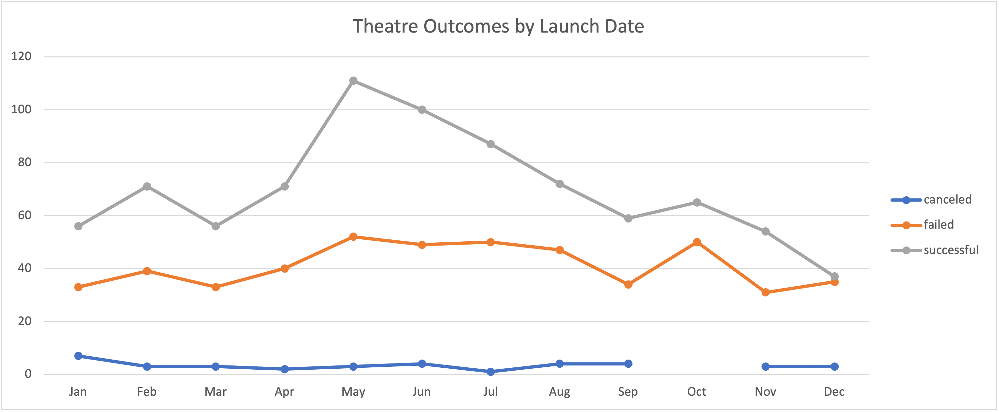
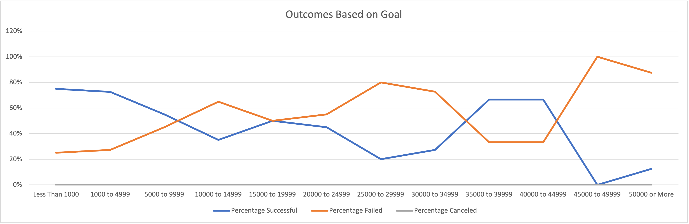

# Kickstarting with Excel

## Overview of Project
The project involves two step reporting of various visual and tabular information regarding various campaigns and their funding goals. The first step involved analyzing theater outcomes based on launch date across successful, failed, and cancelled campaigns. The next step was to visualize how many projects succeeded, failed, and were cancelled based on goal subcategories. 

### Purpose

The purpose of this analysis is to understand how different campaigns fared across launch time and funding goals. 

## Analysis and Challenges

### Analysis of Outcomes Based on Launch Date

Parent Category and Years were used as filters, Outcomes for column and values, and Date Created Conversion for the Rows. Theater successes peak in May and slump in October, suggesting that most campaigns thrive in the active summer months, presumably when consumers have more free time. In December, 37 campaigns succeed and 35 fail, suggesting that as consumers approach Christmas break, they seek to spend more time on vacation or with family as opposed to donating to fundraisers. Potential challenges include but are not limited  discovering explanations for seasonal high and low variations as well as determining how best to organize the pivot table. 

### Analysis of Outcomes Based on Goals

COUNTIFS() were used to calculated counts of success/fail/cancelled campaigns while SUM() statements were used for percentage measures. In accordance with intuition, campaigns are more likely to succeed when their goal is at a lower value. 12 fail and 12 success between 15000 and 19999 (USD) suggesting that this is the recommended "threshold". Challenges encountered were manually constructing the COUNTIFS(). Potential challenges include experimenting with smaller goal range sizes to draw more detailed conclusions. 

### Challenges and Difficulties Encountered

## Results

- What are two conclusions you can draw about the Outcomes based on Launch Date? 

One conclusion regarding the aforementioned chart is that consumers are most likely to donate to fundraising campaigns in the summer, not in the winter. Another conclusion is that it is presumably in these hotter months (May - July) when theatres are more in demand.

- What can you conclude about the Outcomes based on Goals?

A conclusion to be drawn from the aforementioned table and chart pair is that fundraising campaigns are most likely to acheive their goals when the goal is lower, preferably <20000.

- What are some limitations of this dataset?

The Kickstarter dataset has various currency types , from CAD to GBP to USD, making comparison more difficult across country lines. Also, it is difficult to compare across multiple categories at the same time. 

- What are some other possible tables and/or graphs that we could create?

Several tables and accompanying graphs can be created to supplement the analysis. One proposal is an "Outcomes Based on Subcategory" chart to understand what contributes most to success in crowdsourcing within a specific category. Another is "Outcomes Based on Time Differential" which would plot the difference between Date Ended and Date Created as Rows and Count of Outcomes as the values, to analysis if campaigns which were allotted more time fared better. Finally, one could analyze campaign success/fail rates across years for temporal analysis. 